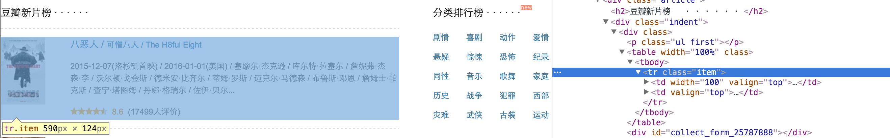
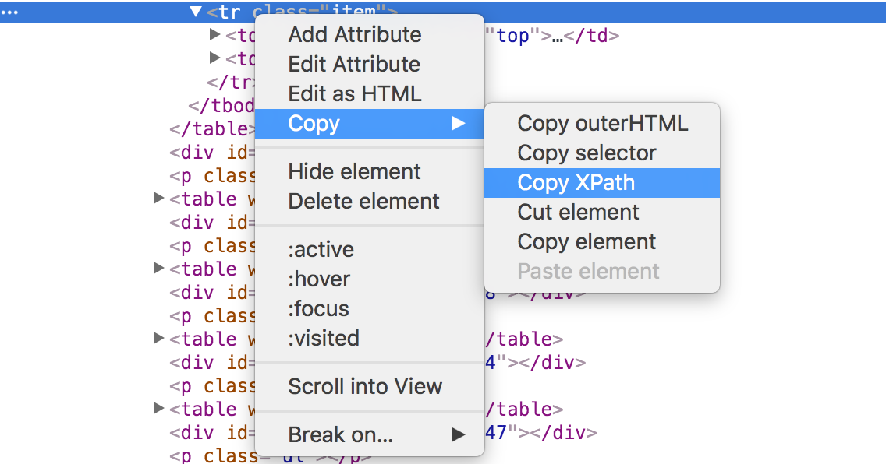
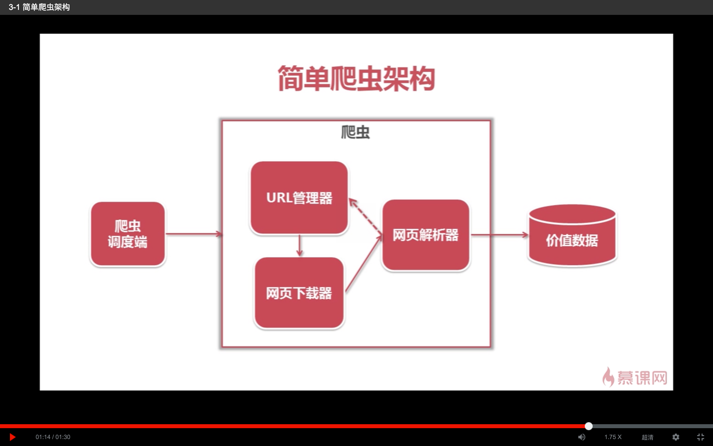
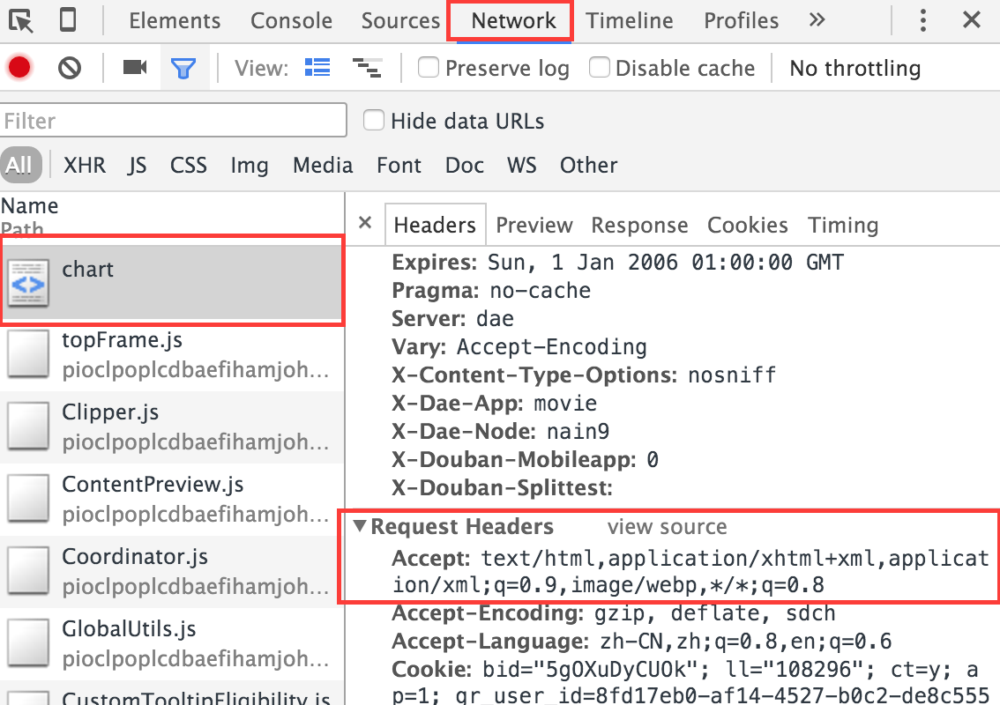
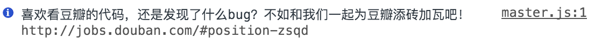

# 使用Object-C爬取豆瓣数据

这个工程主要是使用Object-C语言进行爬取豆瓣电影中的数据，并且将爬取到的数据展示到App中。

> 目的：使用OC做定向爬虫，主要爬取豆瓣电影的TOP250排行、最近热映、本周电影排行进行展示
> 工具：XPath基础知识、DOM基础知识、HTTP网络请求、iOS平台下的OC语言的XML/HTML解析器(Ono或者hpple)、以及一个豆瓣的网页

首先说一下我对[`网页爬虫`](https://zh.wikipedia.org/wiki/%E7%B6%B2%E8%B7%AF%E8%9C%98%E8%9B%9B)的理解:他是一种使用一定的技术手段在互联网上进行信息的抓取的技术。一般说到爬虫，第一个想到的方法就是使用`Python`编写，确实python在用于网页爬取的时候有比较大的优势，框架比较多，代码简洁。插一句，前几天小侄女参加一个什么微信拉票的活动，老哥让我给投票，我想能不能写个什么拉票神器之类的获取个高票，最后还是放弃了，一个是自己不会，另一个是如果发现非法票源，取消资格之类的警告。期间问过我们公司一个同事，如何写一个拉票软件，用什么写。他说，什么都能写啊，你们iOS开发的OC都可以写，只不过不同语言方式不一样，效率不同罢了。

现在想来，也对，如果python可以爬虫，在OC上其实也是可以使用类似的方法进行爬虫的，关键是找到方法。如果使用OC来进行爬虫，需要找到相关类库，但是毕竟不是专门的网络信息抓取工具，在类库的使用下还是需要做很多的工作才能得到想要的资源。庆幸找到了两个类库，一个是matt的[Ono](https://github.com/mattt/Ono)，一个是top的[hpple](https://github.com/topfunky/hpple)。最先接触的是hppla，但是由于当时没有[`XPath`](http://www.w3school.com.cn/xpath/)这方面的概念，简单的看了下，现在要用的时候拿来自己还是不能够了解他的原理，而且输出日志实在是看不懂。在matt的github下找到了Ono，简洁，这一点就够了。


## 爬虫分析

* 第一步需要知道自己需要的资源在哪里：[`豆瓣`](http://movie.doubam.com)，我要爬取豆瓣的新片榜单，就需要在浏览器打开他新片榜的网址。

* 具体在哪里：每一个界面上显示的东西都是由一个个DOM节点组成的，所以需要的资源就是某一个或者某一些节点




* 如何找到他：使用XPath或者CSS选择器可以找到节点位于文档中的唯一位置，这里只使用XPath进行节点的获得，对于CSS选择器的获取方法，不是很熟练



* 最后使用不同平台上的语言特有的方法对节点的数据进行获取。

大致流程就是这样了，下面进行实例抓取豆瓣电影TOP250、新片榜、本周排名三个板块的数据。

## 架构搭建

这是在慕课网上看python的时候截的一张python爬虫架构，由于前期学习的时候是把所有的代码都写在了一个文件中，对功能的划分基本上是没有，所以在转到原生语言OC中进行开发就要进行功能划分了。



### NetWork Request
需要一个网络请求类，万能的网络请求`AFN`，使用`HLLRequestManager`对其进行封装调用，并建一个`AFHTTPSessionManager`的子类：`HLLNetClient`在里面进行一些操作，主要的操作就是对`header`进行修改，对`responseSerializer`进行修改。

修改header主要的目的是伪装成一个电脑浏览器，而不是移动端浏览器，因为现在的网站都已经适配了移动和PC，移动设备下获得的HTML中的DOM树不同于PC下的，这里是抓取PC浏览器下豆瓣的数据，所以需要把网络请求模拟成是PC浏览器发的（还可以防止mac地址被禁？），使用用户代理--`User-Agent`来模拟不同的设备，不同的浏览器：

```
NSString * randomUserAgent(){
    
    NSArray * userAgents = @[@"Mozilla/5.0 (Macintosh; Intel Mac OS X 10_11_0) AppleWebKit/537.36 (KHTML, like Gecko) Chrome/47.0.2526.106 Safari/537.36",
                             @"Mozilla/5.0 (Windows NT 6.2; WOW64) AppleWebKit/537.36 (KHTML, like Gecko) Chrome/35.0.1916.114 Safari/537.36",
                             @"Mozilla/5.0 (X11; Ubuntu; Linux x86_64; rv:36.0) Gecko/20100101 Firefox/36.0",
                             @"Mozilla/5.0 (Windows NT 6.2; WOW64) AppleWebKit/537.36 (KHTML, like Gecko) Chrome/27.0.1453.94 Safari/537.36",
                             @"Mozilla/5.0 (Macintosh; U; Intel Mac OS X 10_6_6; en-US) AppleWebKit/533.20.25 (KHTML, like Gecko) Version/5.0.4 Safari/533.20.27"];
    return userAgents[arc4random() % userAgents.count];
}
```
在header的设置中还需要设置`Host`：

```
	[self.requestSerializer setValue:@"movie.douban.com" forHTTPHeaderField:@"Host"];
```
对`responseSerializer`的修改就简单地多了，基本上对着



设置一下就行了：

```
	self.responseSerializer = [AFHTTPResponseSerializer serializer];
   	self.responseSerializer.acceptableContentTypes = [NSSet setWithObjects:@"application/json", @"text/plain", @"text/javascript", @"text/json", @"text/html",@"application/xhtml+xml",@"application/xml",@"image/webp", nil];
```

### HTML Parse
需要一个HTML解析器，也就是`HLLHTMLParseManager`。用它，这个单例，进行从网络请求下来的数据的HTML中DOM的解析，这个也是对Ono的一个封装，以后如果觉得Ono使用不是很方便或者不能达到要求要转换成hpple，在这里进行修改就可以自由切换了，说实话，后来才发现hpple也是很好用的(逃)。

基本上需要的功能类就这些了，其中解析器需要做的就是对于不同网络请求下来的文档数据，一般是以data数据流返回，进行DOM解析，解析出来不同的数据，供外部使用。难点就在于内部的parse，比较枯燥，这里举一个例子。

解析[TOP250](https://movie.douban.com/top250)请求下来的文档数据，通过XPath找到电影图片的`src`链接，使用`Ono`进行解析:

可以看出来，每一个电影内容都在这个`li`标签下，所以说先获得他的父标签`ol`，然后通过`children`属性得到所有的`li`标签，通过`li`进行他子类标签的获取，需要img的使用img的XPath获取，需要name的使用name的XPath获取，说的真费劲，代码如下：


```
	ONOXMLDocument * document = [ONOXMLDocument HTMLDocumentWithData:data error:&error];

	// 这个就是使用XPath获得的标签在文档中的位置
    NSString * olPath = @"//*[@id=\"content\"]/div/div[1]/ol[@class=\"grid_view\"]";
    
    ONOXMLElement * olELement = [document firstChildWithXPath:olPath];
    NSArray * olElementChildern = olELement.children;

    NSMutableArray  * movies = [NSMutableArray array];
    for (NSUInteger index = 0; index < olElementChildern.count; index ++) {
        HLLMovie * movie = [self hll_parseTOP250MovieWithTrElement:olELement index:index];
        [movies addObject:movie];
    }
```
然后是对需要的内容在不同的`li`标签下使用XPath进行获取，真的很烦。。。

```

- (HLLMovie *) hll_parseTOP250MovieWithTrElement:(ONOXMLElement *)element index:(NSUInteger)index{

//    //*[@id="content"]/div/div[1]/ol/li[1]
//    //*[@id="content"]/div/div[1]/ol/li[2]
    ...
//    //*[@id="content"]/div/div[1]/ol/li[25]
    NSMutableString * liXPath = [NSMutableString stringWithFormat:@"//li[%lu]",(unsigned long)index + 1];
    
    ONOXMLElement * liElement = [element firstChildWithXPath:liXPath];

    ONOXMLElement * imgElement = ({
//        //*[@id="content"]/div/div[1]/ol/li[1]/div/div[1]/a/img
        NSString * imgXPath = fullElementXPathWithFatherXPath(@"div/div[@class=\"pic\"]/a/img", liXPath);
        imgElement = [liElement firstChildWithXPath:imgXPath];
        NSLog(@"img:%@",imgElement.attributes[@"src"]);
        imgElement;
    });
    ...
    HLLMovie * movie = ({
    
        movie = [[HLLMovie alloc] init];
        movie.img = imgElement.attributes[@"src"];
		...
        movie;
    });
    return movie;
}

```

## 写在后面

虽然可以使用网络抓包工具抓取豆瓣客户端的网络请求，得到json数据进行展示，恩，我知道这种方法，现在只是想换一种方法实现一下而已。

由于这是一个定向爬虫，也就说如果豆瓣稍微改变一下DOM，这个爬虫不能用了，就需要针对于豆瓣的修改进行改进了，幸好这里just for fun。

还有，豆瓣的工程师也是蛮逗的，这两天看豆瓣的代码，每次往浏览器右下角看都会笑起来，有种做坏事被发现了的尴尬😜：




也许不久之后我会做一些好玩的东西在里面，也许不会，也许明天豆瓣就把DOM改了，这个工程就废了，也许他一直懒得改。

done。